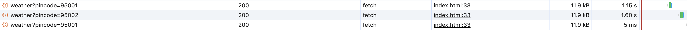

### To start the frontend

In a new terminal, run `python3 -m http.server 8000 -d .` and open `127.0.0.1:8000/index.html` in the browser

### To start the backend

In a new terminal, run `flask run`. it will by default start listening at `127.0.0.1:5000`

### To start redis

In a new terminal, run `redis-server`

The cache ttl is set to 3600 seconds because the weather data is updated every hour

In the below image you can see that the second time the request is made for the same pincode the response is received much faster than the first time, showing that the caching helps

### TODO
put this in a docker compose file so that a single command start all the required services